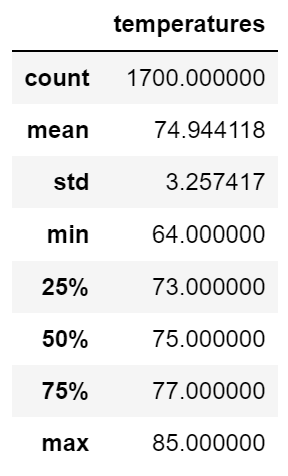

# Surfs_Up
## Overview of Project
The purpose of this project is to analyze the weather in Oahu to see if it will be a good place for a surfshop. W. Avy wants to utilize the data analysis to see if the shop will be busy year-round. By using data from Hawaii sqlite, we can get the average precipitation and temperature for a specific date range. We start looking at the previous year and then dive deeper and getting the data for June/December.

## Results
1. The average temperature for June is 74F and for December it is 71F.
2. The minimum temperature for June is 64F and for December it is 69F. 
3. The maximum temperature for June is 85F and for December if is 83F. 

 

## Summary
Provide a high-level summary of the results and two additional queries that you would perform to gather more weather data for June and December.
Temperature in Hawaii is consistent. The highest and lowest temperatures from June and Decembert are similar and only aroun 4 - 5 degrees difference. Based on that, the shop would be able to stay open for the full year. I believe we should also build a query for precipitation because one the rainiest months people will not be exciting to go out to surf and get some icecream. Another query that would be helpful is station that way we can see which part of the island gets less rain. By building near that station, the surf shop would be able to stay open more days of the year. 
